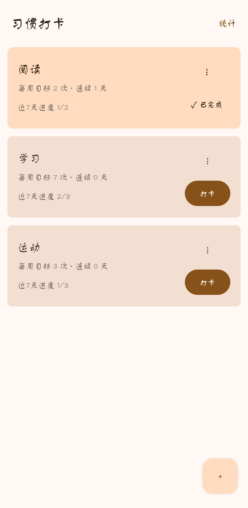
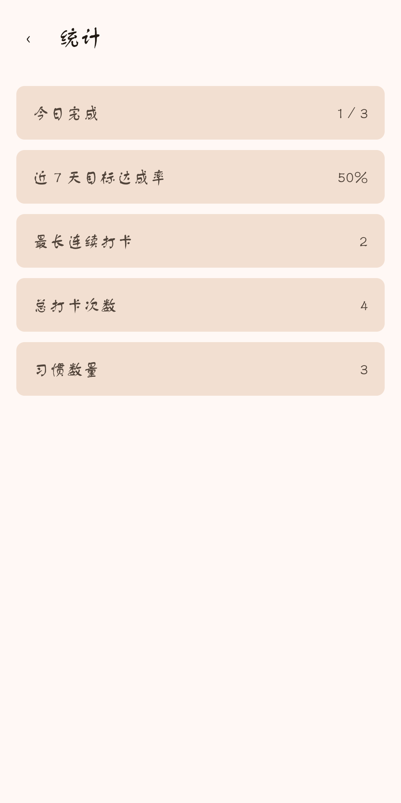

# Habit Tracker · 习惯打卡

一个使用 Kotlin、Jetpack Compose 和 Room 实现的本地习惯打卡 App。项目以“完成一个可靠的本地功能闭环”为目标，重点实现响应式 UI、数据一致性、可测试业务逻辑与渐进式工程化能力。

## 功能概览

- 创建习惯，并设置每周目标次数（1～7 次）。
- 编辑习惯名称和每周目标；通过卡片操作菜单删除习惯，并进行二次确认。
- 今日打卡与取消打卡，支持快速重复点击下的乐观更新、状态收敛和失败回滚提示。
- 展示当前连续打卡天数、历史最长连续打卡天数，以及每个习惯近 7 天的目标进度。
- 统计页汇总今日完成数、总打卡次数、习惯数量、最长连续打卡和近 7 天目标达成率。
- 支持浅色/深色模式与 Android 12 及以上的动态颜色；关键操作具有无障碍语义描述。

## 界面预览

### Dashboard

<p align="center">
  
  
</p>

### 新增习惯

<p align="center">
  
</p>

### 统计页

<p align="center">
  
</p>

## 技术栈

- Kotlin
- Jetpack Compose + Material 3
- MVVM
- Room + SQLite
- Kotlin Flow / StateFlow / SharedFlow
- Navigation Compose
- JUnit、Room Instrumented Test、Compose UI Test、Android Lint

## 架构与数据流

```text
Compose UI
    ↓ 用户意图
ViewModel
    ↓ 业务决策 / Repository
UseCase、Room DAO
    ↓
SQLite
    ↓ Flow 数据变化
ViewModel UI State
    ↓
Compose UI
```

- Compose 页面只负责状态展示和事件上报；页面通过 `collectAsStateWithLifecycle` 观察 ViewModel 状态。
- `DashboardViewModel`、`StatsViewModel` 和新增/编辑习惯的 ViewModel 分别组装页面级 UI state。
- 当前阶段通过 Application 级 `AppContainer` 集中创建数据库、Repository、UseCase 与 ViewModel Factory，`MainActivity` 从容器取得依赖；当前规模下不引入 Hilt 或多模块。

## 关键设计

### 打卡数据一致性与乐观更新

`RecordEntity` 对 `(habitId, date)` 建立唯一索引，DAO 使用事务收敛单日打卡写入。用户点击后，`SetTodayHabitCheckedUseCase` 先发出乐观状态，再等待持久化数据源确认：

- 快速重复点击只保留最新目标状态；
- 持久化失败或数据源确认超时时，会撤销乐观状态并通过 Snackbar 提示重试；
- 数据源确认后移除临时覆盖，最终始终以持久化数据源为准。

### 日期与连续打卡

打卡日期存储为 epoch day，而不是本地午夜时间戳，避免夏令时与时区换算造成同一天判断不稳定。Dashboard 与统计页分别使用 `systemTodayFlow()` 感知本地日期变化，并重新计算“今日状态”和 streak。

`calculateStreak()` 与 `calculateLongestStreak()` 保持为纯函数：前者用于当前连续天数，后者从完整历史中寻找最长连续片段，二者不混用统计口径。

### 每周目标与统计口径

每个习惯有独立的 `targetPerWeek`。近 7 天目标进度以滚动窗口统计；对创建不足 7 天的新习惯，有效目标取每周目标次数与窗口内实际可用天数的较小值，完成次数不会超过该有效目标。统计页的“近 7 天目标达成率”汇总这些进度，而非简单的打卡天数比例。

### 数据库演进

- `MIGRATION_2_3`：将旧的本地午夜毫秒日期转换为 epoch day，合并同一习惯同一天的历史重复记录，并建立唯一索引。
- `MIGRATION_3_4`：为记录表增加指向习惯表的外键与 `CASCADE` 删除，清理孤立记录。

迁移场景通过 Room 仪器测试覆盖，避免只依赖新装 App 的建表结果。

## 项目结构

```text
app/src/main/java/io/github/alight77/habittracker
├── core/time/              # 本地日期变化的 Flow
├── data/local/             # Room Entity、DAO 与迁移
├── data/repository/        # 数据访问封装
├── domain/model/           # 领域约束
├── domain/usecase/         # 日期、streak、目标进度与打卡 UseCase
├── feature/
│   ├── addhabit/           # 新增习惯 Screen 与 ViewModel
│   ├── dashboard/          # Dashboard 状态、交互与卡片
│   ├── edit/               # 编辑习惯 Screen 与 ViewModel
│   └── stats/              # 统计计算、状态与页面
├── ui/                     # 共享表单组件、导航与主题
└── AppContainer、Application、Factory、MainActivity
```

## 构建与验证

使用 Android Studio 打开项目、完成 Gradle Sync 后，选择 API 24 及以上的设备或模拟器运行 App。

```powershell
# Kotlin 编译检查
.\gradlew.bat :app:compileDebugKotlin

# JVM 单元测试：纯函数、UseCase、ViewModel 等
.\gradlew.bat :app:testDebugUnitTest

# AVD / 真机仪器测试：Room、迁移和 Compose UI
.\gradlew.bat :app:connectedDebugAndroidTest

# 静态检查
.\gradlew.bat :app:lintDebug
```

最近一次完整验证中，Lint 为 0 errors；仪器测试 24/24 通过。

## 有意保留的边界

为了保持项目范围聚焦、核心链路清晰，当前不引入以下内容：

- Hilt、复杂 MVI 或多模块拆分；
- 登录、云同步、服务端接口；
- 通知调度、复杂统计图表、完整设计系统；
- 为消除版本提示而进行的集中依赖升级，或发布级 CI/CD。

这些可作为后续演进方向；当前版本优先保证本地功能闭环、代码边界和验证证据清晰。
